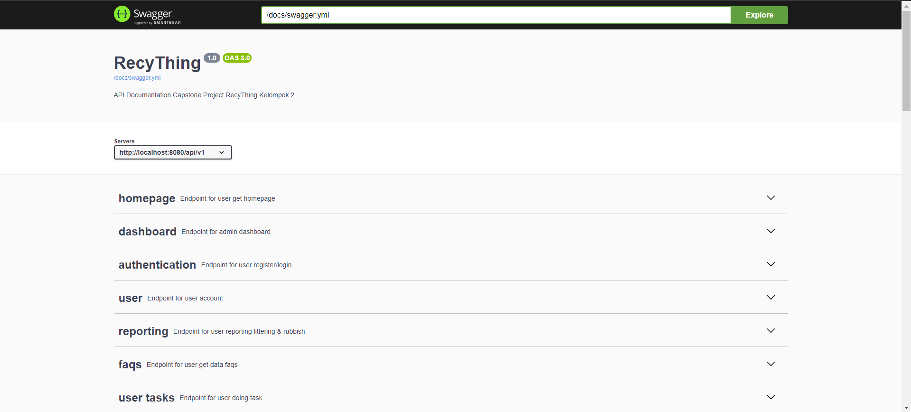
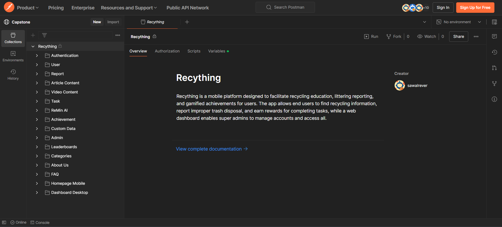

# Recything - Backend

Recything is a mobile platform designed to facilitate recycling education, littering reporting, and gamified achievements for users. The app allows end users to find recycling information, report improper trash disposal, and earn rewards for completing tasks, while a web dashboard enables super admins to manage accounts and access all data.


[( Recything - Web )](https://recything.netlify.app/)

## Features

### User

- Register / Login account
- Edit user detail
- Homepage mobile
- Reporting Littering / Rubbish
- Customer service with an AI
- Article content for an education
- Video content for an education
- Doing task challenge to earn rewards
- About our team
- Achievements detail (leaderboard)

### Superadmin / Admin

- Login Superadmin / Admin
- Dashboard admin
- Manage Admins data (only superadmin)
- Manage Users data
- Manage Reports (approve/reject report from user)
- Manage Articles (add/update/delete)
- Manage Videos (add/update/delete)
- Manage Achievement (update target point for an each badge)
- Manage Custom Data for dataset AI
- Manage Tasks (approving/rejecting task user)

## TechStacks

- [Echo](https://github.com/labstack/echo) (Web Framework Go)
- [Cloudinary](https://github.com/cloudinary/cloudinary-go/) (Cloud storage free)
- [Viper](https://github.com/spf13/viper) (Configuration)
- [Validator](https://github.com/go-playground/validator) (Type validation)
- [JWT](https://github.com/golang-jwt/jwt) (Middleware)
- [OpenAI](https://github.com/sashabaranov/go-openai) (Chat Bot)
- MySQL (SQL)
- [GORM](https://gorm.io/docs/) (ORM)
- AWS EC2 (Deployment)

## API Documentation

[( Swagger API )](https://recything.site/)


[( Postman API )](https://www.postman.com/sawalrever23/workspace/capstone/collection/34865902-43aa5087-a7e3-4c4b-89b6-749fafe0a359?action=share&creator=34865902)


## ERD

[( ERD - draw.io )](https://drive.google.com/file/d/1fbE-hpS4z3lMEEUfUAiL2XWvwETfgipp/view)


## Setup

### Manually

1. Rename **config.example.yaml** to **config.yaml**
2. Fill all the field in **config.yaml** with your configuration
3. Make sure you have **GO** version **1.22+** and **MySQL** to run this project
4. Create new database in **MySQL** named **recything_db**
5. Run the program
   ```bash
   go run cmd/api/main.go
   ```

### Docker

1. Build an image
   ```bash
   docker build -t sawalrever23/recything-be:latest .
   ```
2. Create new network
   ```bash
   docker network create api-network
   ```
3. Pull MySQL image (if you don't have one)
   ```bash
   docker pull mysql
   ```
4. Pull Golang image (if you don't have one)
   ```bash
   docker pull golang
   ```
5. Run MySQL on port 3306
   ```bash
   docker run -itd --name mysql-service \
    --network api-network \
    -p 3306:3306 \
    -e MYSQL_ROOT_PASSWORD={your_password} \
    -e MYSQL_DATABASE=recything_db \
    -v /tmp/mysql-volume:/var/lib/mysql \
    mysql:latest
   ```
6. Run our build
   ```bash
   docker run -itd --name recything-be \
   -p 8080:8080 \
   --network api-network \
   --restart on-failure \
   sawalrever23/recything-be:latest
   ```

### Docker Compose

- Running our compose

  ```bash
  docker compose up -d
  ```

- Stopping compose
  ```bash
  docker compose down
  ```
